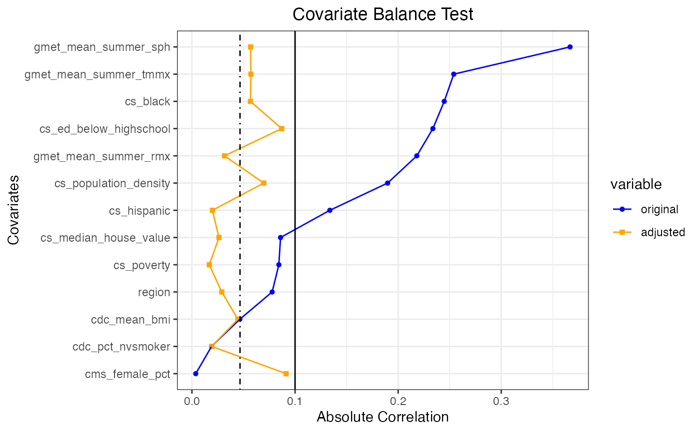
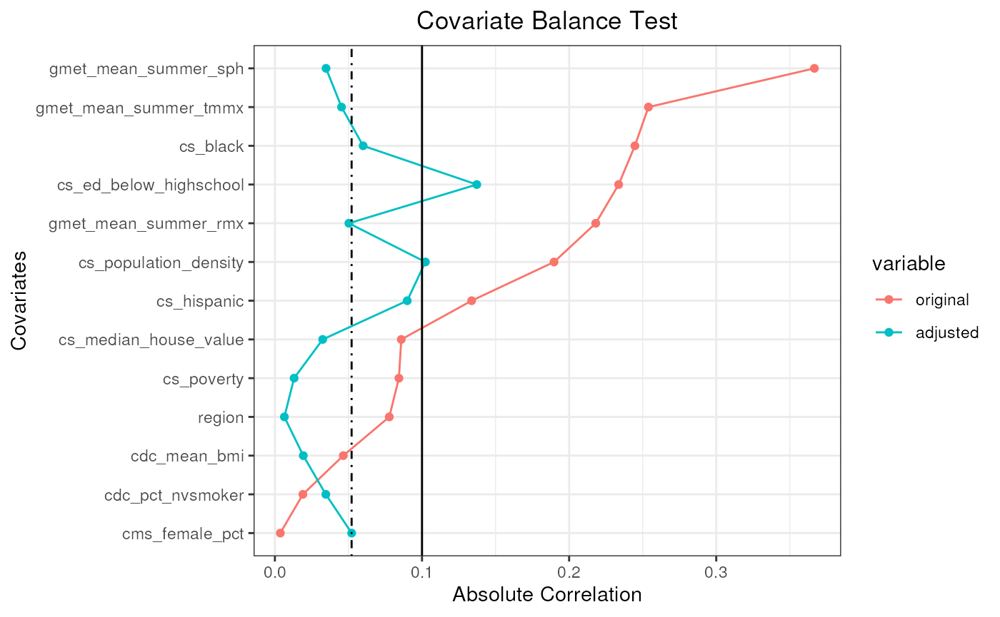
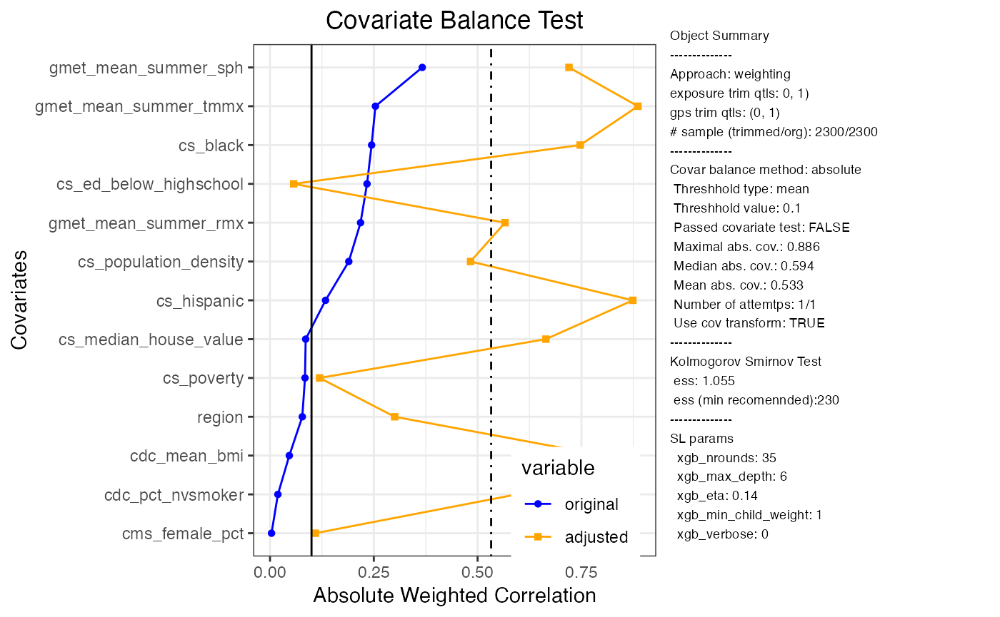
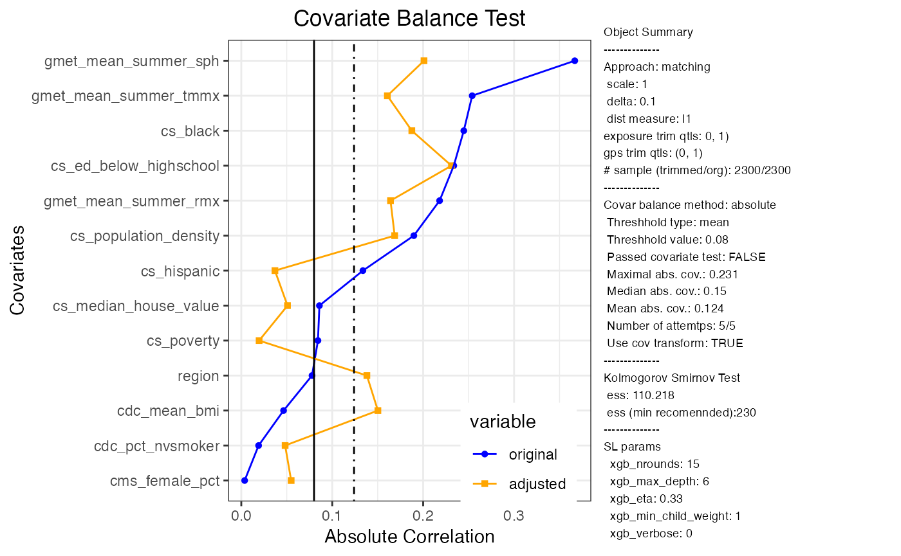

# Synthetic Medicare Data

``` r
library(CausalGPS)
library(ggplot2)
```

In this vignette, we present application of CausalGPS package on the
Synthetic Medicare Data. In the dataset, we link the 2010 synthetic
Medicare claims data to environmental exposures and potential
confounders. The dataset is hosted on Harvard Dataverse (Khoshnevis, Wu,
and Braun 2022).

## Load Data and Preprocessing

``` r
data("synthetic_us_2010")
data <- synthetic_us_2010
knitr::kable(head((data)))
```

| FIPS | qd_mean_pm25 | NAME | cs_poverty | cs_hispanic | cs_black | cs_white | cs_native | cs_asian | cs_ed_below_highschool | cs_household_income | cs_median_house_value | cs_total_population | cs_other | cs_area | cs_population_density | cdc_mean_bmi | cdc_pct_cusmoker | cdc_pct_sdsmoker | cdc_pct_fmsmoker | cdc_pct_nvsmoker | cdc_pct_nnsmoker | gmet_mean_tmmn | gmet_mean_summer_tmmn | gmet_mean_winter_tmmn | gmet_mean_tmmx | gmet_mean_summer_tmmx | gmet_mean_winter_tmmx | gmet_mean_rmn | gmet_mean_summer_rmn | gmet_mean_winter_rmn | gmet_mean_rmx | gmet_mean_summer_rmx | gmet_mean_winter_rmx | gmet_mean_sph | gmet_mean_summer_sph | gmet_mean_winter_sph | cms_mortality_pct | cms_white_pct | cms_black_pct | cms_others_pct | cms_hispanic_pct | cms_female_pct | STATE | STATE_CODE | region |
|---:|---:|:---|---:|---:|---:|---:|---:|---:|---:|---:|---:|---:|---:|---:|---:|---:|---:|---:|---:|---:|---:|---:|---:|---:|---:|---:|---:|---:|---:|---:|---:|---:|---:|---:|---:|---:|---:|---:|---:|---:|---:|---:|---:|:---|:---|
| 1001 | 11.85557 | Autauga County, Alabama | 0.0858086 | 0.0028053 | 0.1320132 | 0.8524752 | 0.0087459 | 0.0026403 | 0.2533003 | 37351 | 133900 | 53155 | 0.0013201 | 594.436 | 89.42090 | 3208.390 | 0.1463415 | 0.0243902 | 0.2439024 | 0.5609756 | 0.0243902 | 283.8634 | 295.4464 | 273.0409 | 297.2615 | 307.2943 | 284.5251 | 40.42980 | 45.25372 | 43.95282 | 88.97211 | 95.95946 | 85.72278 | 0.0094171 | 0.0167348 | 0.0040017 | 0.0000000 | 0.5958904 | 0.4041096 | 0.0000000 | 0.0000000 | 0.5547945 | 1 | AL | SOUTH |
| 1003 | 10.43793 | Baldwin County, Alabama | 0.0533287 | 0.0140393 | 0.0515350 | 0.9186271 | 0.0054157 | 0.0022422 | 0.1609521 | 40104 | 177200 | 175791 | 0.0081407 | 1589.784 | 110.57540 | 3249.755 | 0.1470588 | 0.0392157 | 0.2450980 | 0.5686275 | 0.0000000 | 285.8735 | 296.6723 | 275.4020 | 298.1579 | 306.4516 | 287.3572 | 42.34226 | 50.02479 | 43.42646 | 90.28333 | 95.14939 | 88.16227 | 0.0102607 | 0.0172820 | 0.0047839 | 0.0227273 | 0.6384298 | 0.3533058 | 0.0082645 | 0.0000000 | 0.5392562 | 1 | AL | SOUTH |
| 1005 | 11.50424 | Barbour County, Alabama | 0.1944298 | 0.0094587 | 0.3334209 | 0.6560694 | 0.0000000 | 0.0000000 | 0.4051498 | 22143 | 88200 | 27699 | 0.0010510 | 884.876 | 31.30269 | 2953.693 | 0.0714047 | 0.0504250 | 0.2168344 | 0.5645023 | 0.0111988 | 284.1352 | 295.3782 | 273.8296 | 297.6494 | 307.0302 | 285.5848 | 40.05212 | 46.02080 | 43.77853 | 90.76408 | 96.72028 | 86.72719 | 0.0097046 | 0.0169258 | 0.0043431 | 0.0000000 | 0.6901408 | 0.2816901 | 0.0281690 | 0.0000000 | 0.5070423 | 1 | AL | SOUTH |
| 1007 | 11.88692 | Bibb County, Alabama | 0.1130868 | 0.0010669 | 0.1219772 | 0.8662873 | 0.0000000 | 0.0000000 | 0.3886913 | 24875 | 81200 | 22610 | 0.0106686 | 622.582 | 36.31650 | 3255.287 | 0.1034483 | 0.0229885 | 0.3103448 | 0.5517241 | 0.0114943 | 283.5388 | 295.3145 | 272.5781 | 296.7969 | 307.0417 | 283.9070 | 41.59857 | 47.24975 | 43.87743 | 89.57623 | 96.48472 | 85.84614 | 0.0093942 | 0.0169568 | 0.0038307 | 0.0215264 | 0.6555773 | 0.3405088 | 0.0039139 | 0.0000000 | 0.5714286 | 1 | AL | SOUTH |
| 1009 | 11.65920 | Blount County, Alabama | 0.1047926 | 0.0094363 | 0.0105538 | 0.9684629 | 0.0058356 | 0.0000000 | 0.3594487 | 25857 | 113700 | 56692 | 0.0057114 | 644.776 | 87.92511 | 3500.333 | 0.0833333 | 0.0000000 | 0.2500000 | 0.6388889 | 0.0277778 | 282.6099 | 294.7041 | 271.3427 | 295.5558 | 306.4517 | 281.9145 | 42.44578 | 48.28317 | 46.07121 | 88.72523 | 96.37532 | 84.95932 | 0.0089541 | 0.0165894 | 0.0035027 | 0.0062112 | 0.7018634 | 0.2981366 | 0.0000000 | 0.0000000 | 0.6086957 | 1 | AL | SOUTH |
| 1011 | 11.65386 | Bullock County, Alabama | 0.1701807 | 0.0000000 | 0.5903614 | 0.4096386 | 0.0000000 | 0.0000000 | 0.4487952 | 20500 | 66300 | 10923 | 0.0000000 | 622.805 | 17.53839 | 3400.474 | 0.1282051 | 0.0384615 | 0.3333333 | 0.5000000 | 0.0000000 | 283.3906 | 295.0217 | 273.1478 | 297.2145 | 306.8042 | 285.0072 | 41.29272 | 46.77274 | 44.80368 | 92.81798 | 97.60276 | 88.14277 | 0.0096621 | 0.0169198 | 0.0042435 | 0.0103245 | 0.6666667 | 0.3185841 | 0.0132743 | 0.0014749 | 0.5501475 | 1 | AL | SOUTH |

``` r
# transformers
pow2 <- function(x) {x^2}
pow3 <- function(x) {x^3}
clog <- function(x) log(x+0.001)

confounders <- names(data)
confounders <- confounders[!(confounders %in% c("FIPS","Name","STATE", 
                                                "STATE_CODE","cms_mortality_pct",
                                                "qd_mean_pm25"))]
```

## Examples of Generating Pseudo Population

### Scenario 1

- Causal Inference: Matching
- GPS model: Parametric
- Optimized_compile: True

``` r

confounders_s1 <- c("cs_poverty","cs_hispanic",
                   "cs_black",
                   "cs_ed_below_highschool",
                   "cs_median_house_value",
                   "cs_population_density",
                   "cdc_mean_bmi","cdc_pct_nvsmoker",
                   "gmet_mean_summer_tmmx",
                   "gmet_mean_summer_rmx",
                   "gmet_mean_summer_sph",
                   "cms_female_pct", "region"
)

study_data <- data[, c("qd_mean_pm25", confounders, "cms_mortality_pct")]
study_data$id <- seq_along(1:nrow(study_data))
study_data$region <- as.factor(study_data$region)
study_data$cs_PIR <- study_data$cs_median_house_value/study_data$cs_household_income

# Choose subset of data
q1 <- stats::quantile(study_data$qd_mean_pm25, 0.25)
q2 <- stats::quantile(study_data$qd_mean_pm25, 0.99)
trimmed_data <- subset(study_data[stats::complete.cases(study_data) ,],
                       qd_mean_pm25 <= q2  & qd_mean_pm25 >= q1)

trimmed_data$gmet_mean_summer_sph <- pow2(trimmed_data$gmet_mean_summer_sph)


set.seed(172)
pseudo_pop_1 <- generate_pseudo_pop(trimmed_data[, c("id", 
                                                     "qd_mean_pm25")],
                                    trimmed_data[, c("id", 
                                                     confounders_s1)],
                                    ci_appr = "matching",
                                    gps_density = "normal",
                                    bin_seq = NULL,
                                    exposure_trim_qtls = c(0.0 ,
                                                       1.0),
                                    use_cov_transform = TRUE,
                                    transformers = list("pow2","pow3","clog"),
                                    sl_lib = c("m_xgboost"),
                                    params = list(xgb_nrounds=c(17),
                                                  xgb_eta=c(0.28)),
                                    nthread = 1,
                                    covar_bl_method = "absolute",
                                    covar_bl_trs = 0.1,
                                    covar_bl_trs_type = "mean",
                                    max_attempt = 1,
                                    dist_measure = "l1",
                                    delta_n = 0.1,
                                    scale = 1)
#> mean absolute correlation: 0.150596118336646| Covariate balance threshold: 0.1
#> Loading required package: nnls
#> mean absolute correlation: 0.0466272611362718| Covariate balance threshold: 0.1
#> Covariate balance condition has been met (iteration: 1/1)
#> Best mean absolute correlation: 0.0466272611362718| Covariate balance threshold: 0.1

plot(pseudo_pop_1)
```



### Scenario 2

- Causal Inference: Matching
- GPS model: Parametric
- Optimized_compile: False

``` r
set.seed(172)
pseudo_pop_2 <- generate_pseudo_pop(trimmed_data[, c("id", 
                                                     "qd_mean_pm25")],
                                    trimmed_data[, c("id", confounders_s1)],
                                    ci_appr = "matching",
                                    gps_density = "normal",
                                    bin_seq = NULL,
                                    exposure_trim_qtls = c(0.0 ,
                                                       1.0),
                                    use_cov_transform = TRUE,
                                    transformers = list("pow2","pow3","clog"),
                                    sl_lib = c("m_xgboost"),
                                    params = list(xgb_nrounds=c(17),
                                                  xgb_eta=c(0.28)),
                                    nthread = 1,
                                    covar_bl_method = "absolute",
                                    covar_bl_trs = 0.1,
                                    covar_bl_trs_type = "mean",
                                    max_attempt = 1,
                                    dist_measure = "l1",
                                    delta_n = 0.1,
                                    scale = 1)
#> mean absolute correlation: 0.150596118336646| Covariate balance threshold: 0.1
#> mean absolute correlation: 0.0466272611362718| Covariate balance threshold: 0.1
#> Covariate balance condition has been met (iteration: 1/1)
#> Best mean absolute correlation: 0.0466272611362718| Covariate balance threshold: 0.1

plot(pseudo_pop_2)
```


``` r
optimized_data_1 <- pseudo_pop_1$pseudo_pop[,c("qd_mean_pm25","gps","counter_weight")]
nonoptimized_data_2 <- pseudo_pop_2$pseudo_pop[,c("qd_mean_pm25","gps","counter_weight")]


print(paste("Number of rows of data in the optimized approach: ",
            nrow(optimized_data_1)))
#> [1] "Number of rows of data in the optimized approach:  2300"

print(paste("Number of rows of data in the non-optimized approach: ",
            nrow(nonoptimized_data_2)))
#> [1] "Number of rows of data in the non-optimized approach:  2300"

print(paste("Sum of data samples in the optimized approach: ",
            sum(optimized_data_1$counter_weight)))
#> [1] "Sum of data samples in the optimized approach:  140300"
print(paste("Number of data in the non-optimized approach: ",
            length(nonoptimized_data_2$qd_mean_pm25)))
#> [1] "Number of data in the non-optimized approach:  2300"

# Replicate gps values of optimized approach
expanded_opt_data_1 <- optimized_data_1[rep(seq_len(nrow(optimized_data_1)),
                                            optimized_data_1$counter_weight), 1:3]

exp_gps_a_1 <- expanded_opt_data_1$gps
gps_b_1 <- nonoptimized_data_2$gps

differences <- sort(gps_b_1) - sort(exp_gps_a_1)

print(paste("Sum of differences in gps values between optimized and ", 
            "non-optimized approaches is: ",
            sum(differences)))
#> [1] "Sum of differences in gps values between optimized and  non-optimized approaches is:  38958.9033869061"
```

### Scenario 3

- Causal Inference: Matching
- GPS model: Non-Parametric
- Optimized_compile: True

``` r
trimmed_data <- subset(study_data[stats::complete.cases(study_data) ,],
                       qd_mean_pm25 <= q2  & qd_mean_pm25 >= q1)

set.seed(8967)
pseudo_pop_3 <- generate_pseudo_pop(trimmed_data[, c("id", 
                                                     "qd_mean_pm25")],
                                    trimmed_data[, c("id", confounders_s1)],
                                    ci_appr = "matching",
                                    gps_density = "kernel",
                                    bin_seq = NULL,
                                    exposure_trim_qtls = c(0.0 ,
                                                       1.0),
                                    use_cov_transform = TRUE,
                                    transformers = list("pow2","pow3","clog"),
                                    sl_lib = c("m_xgboost"),
                                    params = list(xgb_nrounds=c(12),
                                                  xgb_eta=c(0.1)),
                                    nthread = 1,
                                    covar_bl_method = "absolute",
                                    covar_bl_trs = 0.1,
                                    covar_bl_trs_type = "mean",
                                    max_attempt = 1,
                                    dist_measure = "l1",
                                    delta_n = 0.1,
                                    scale = 1)
#> mean absolute correlation: 0.150596118336646| Covariate balance threshold: 0.1
#> mean absolute correlation: 0.0521458538948391| Covariate balance threshold: 0.1
#> Covariate balance condition has been met (iteration: 1/1)
#> Best mean absolute correlation: 0.0521458538948391| Covariate balance threshold: 0.1

plot(pseudo_pop_3)
```



### Scenario 4

- Causal Inference: Weighting
- GPS model: Parametric
- Optimized_compile: N/A

``` r
trimmed_data <- subset(study_data[stats::complete.cases(study_data) ,],
                       qd_mean_pm25 <= q2  & qd_mean_pm25 >= q1)

trimmed_data$cs_poverty <- pow2(trimmed_data$cs_poverty)

set.seed(672)
pseudo_pop_4 <- generate_pseudo_pop(trimmed_data[, c("id", 
                                                     "qd_mean_pm25")],
                                    trimmed_data[, c("id", confounders_s1)],
                                    ci_appr = "weighting",
                                    gps_density = "normal",
                                    bin_seq = NULL,
                                    exposure_trim_qtls = c(0.0 ,
                                                       1.0),
                                    use_cov_transform = TRUE,
                                    transformers = list("pow2","pow3","clog"),
                                    sl_lib = c("m_xgboost"),
                                    params = list(xgb_nrounds=c(35),
                                                  xgb_eta=c(0.14)),
                                    nthread = 1,
                                    covar_bl_method = "absolute",
                                    covar_bl_trs = 0.1,
                                    covar_bl_trs_type = "mean",
                                    max_attempt = 1,
                                    dist_measure = "l1",
                                    delta_n = 0.1,
                                    scale = 1)
#> mean absolute correlation: 0.150596118336646| Covariate balance threshold: 0.1
#> mean absolute correlation: 0.532572233294456| Covariate balance threshold: 0.1
#> Covariate balance condition has not been met.
#> Best mean absolute correlation: 0.532572233294456| Covariate balance threshold: 0.1

plot(pseudo_pop_4)
```



## Covariate Balance

In the previous examples, we passed specific parameters for estimating
GPS values. Achieving acceptable covariate balance can be computed by
searching for the most appropriate parameters and might not be a simple
task. This package uses transformers on the features to get an
acceptable covariate balance. The following parameters are directly
related to searching for an acceptable covariate balance.

- **covar_bl_trs**: Is the acceptable threshold to stop searching. It
  can be computed either by `mean`, `median`, or `maximal` value of
  features correlation, which is defined in **covar_bl_trs_type**.
- **params**: In different iterations, we choose a parameter at random
  from the provided list. For example, by `xgb_nrounds=seq(1,100)` in
  the parameters, `nround` parameter for `xgboost` trainer will be
  selected a number between 1 and 100 at random, at each iteration.
- **transformers**: After each iteration, we choose a feature with the
  highest correlation and apply a transformer from the provided list.
  All transformers should be applied to a feature before reapplying the
  same transformer on the same feature.
- **max_attempt**: Number of test iteration. If the covar_bl_trs is not
  met, the search will stop after max_attempt iteration and will return
  the best found population.

### Scenario 5

- Causal Inference: Matching + searching for acceptable covariate
  balance

- GPS model: Non-Parametric

- Optimized_compile: True

- Search domain:

  - `transformers`: `pow2`, `pow3`, `clog`.
  - `nround` for `xgboost`: 10-100.
  - `eta` for `xgboost`: 0.1-0.5.
  - `max_attempt`: 5.
  - `covar_bl_trs`: 0.08.
  - `covar_bl_trs_type`: `mean`

``` r
trimmed_data <- subset(study_data[stats::complete.cases(study_data) ,],
                       qd_mean_pm25 <= q2  & qd_mean_pm25 >= q1)

set.seed(328)
pseudo_pop_5 <- generate_pseudo_pop(trimmed_data[, c("id", 
                                                     "qd_mean_pm25")],
                                    trimmed_data[, c("id", confounders_s1)],
                                    ci_appr = "matching",
                                    gps_density = "kernel",
                                    bin_seq = NULL,
                                    exposure_trim_qtls = c(0.0 ,
                                                       1.0),
                                    use_cov_transform = TRUE,
                                    transformers = list("pow2","pow3","clog"),
                                    sl_lib = c("m_xgboost"),
                                    params = list(xgb_nrounds=seq(10, 100, 1),
                                                  xgb_eta=seq(0.1,0.5,0.01)),
                                    nthread = 1,
                                    covar_bl_method = "absolute",
                                    covar_bl_trs = 0.08,
                                    covar_bl_trs_type = "mean",
                                    max_attempt = 5,
                                    dist_measure = "l1",
                                    delta_n = 0.1,
                                    scale = 1)
#> mean absolute correlation: 0.150596118336646| Covariate balance threshold: 0.08
#> mean absolute correlation: 0.123983603260029| Covariate balance threshold: 0.08
#> mean absolute correlation: 0.200346741127591| Covariate balance threshold: 0.08
#> mean absolute correlation: 0.165910759386325| Covariate balance threshold: 0.08
#> mean absolute correlation: 0.160872521798462| Covariate balance threshold: 0.08
#> mean absolute correlation: 0.180468747869512| Covariate balance threshold: 0.08
#> Covariate balance condition has not been met.
#> Best mean absolute correlation: 0.123983603260029| Covariate balance threshold: 0.08

plot(pseudo_pop_5)
```



In this example, after 5 attempts, we could not find a pseudo population
that can satisfy the covariate balance test.

## References

Khoshnevis, Naeem, Xiao Wu, and Danielle Braun. 2022. “Synthetic
Medicare Data for Environmental Health Studies.” Harvard Dataverse.
<https://doi.org/10.7910/DVN/L7YF2G>.
